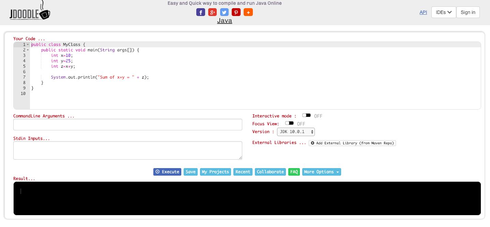

# Первая программа

## Цель задания:
Научиться запускать простейшую программу с помощью онлайн-сервиса https://www.jdoodle.com/online-java-compiler

## Задание:
 - В веб-браузере (Google Chrome, Mozilla Firefox, Safari, Opera или другой) открыть страницу
 https://www.jdoodle.com/online-java-compiler
 Вы должны увидеть:
 